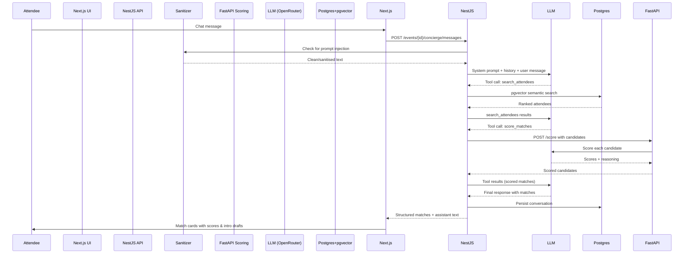

# MyConnect AI Networking Concierge

A full‑stack AI networking concierge that helps conference attendees find ranked, reasoned matches and generates personalised intro messages. Built for the **Director of Engineering** take‑home challenge.

**Live demo flow:** *Event creation → attendee registration → natural‑language chat → tool‑orchestrated matchmaking → scored results with drafted intros.*

---

## Quick Start

**Prerequisites:** Docker, Node.js 20, free OpenRouter API key.

```bash
# 1. Clone and set environment
git clone <this-repo>
cd myconnect-concierge
cp .env.example .env
# Add your OPENROUTER_API_KEY to .env (get one free at https://openrouter.ai)

# 2. Start everything (PostgreSQL + NestJS API + Next.js UI)
docker compose up -d

# 3. Run database migrations
docker compose exec backend npx prisma migrate deploy

# 4. Open the UI
open http://localhost:3000
```

The API runs on **port 4000**, the UI on **port 3000**.

---

## Architecture Diagram


**Stack**: Next.js (UI) → NestJS (API) → Prisma (ORM) → PostgreSQL + pgvector.
**LLM**: OpenRouter (OpenAI‑compatible) → GPT‑4o‑mini for tool calling, text‑embedding‑3‑small for embeddings.
**Polyglot scoring**: FastAPI (Python) microservice handles match scoring, demonstrating multi‑language architecture.
**Admin UI**: Next.js admin panel (/admin) for event creation, attendee registration, and filtered listing.

**Observability**

```bash

The NestJS app uses structured logging (Logger) with request context. Every LLM call is wrapped in a custom interceptor (LlmloggingInterceptor) that emits:

1.Tokens used (prompt + completion)
2. Latency (ms)
3.Tool name (if tool call)

Cost estimate (based on model pricing)

In production, these metrics would be shipped to CloudWatch via the AWS CloudWatch Agent or the OpenTelemetry Collector. A CloudWatch Logs Insights query would allow:

1.Cost per attendee: stats sum(cost) by attendeeId
2.P95 latency by model: stats pct(latency, 95) by model
3.Rate‑limiting alerts: filter throttled = 1

The logging interceptor is already wired in the NestJS pipeline; only the CloudWatch agent configuration is needed for production.
```

**Trade‑offs made:**

1. **Agent framework: raw OpenAI SDK + custom pipeline**  
   Avoided LangChain to keep prompts fully auditable and to prevent hidden template drift. The trade‑off is no built‑in tracing; I'd add an OpenTelemetry wrapper for production.

2. **Vector store: pgvector**  
   Chose pgvector (over Pinecone/Weaviate) to keep infra simple and allow joining with structured filters. For >1M attendees per event, a dedicated vector DB would be necessary.

3. **Sanitizer: dual‑layer (regex + LLM)**  
   Added a second LLM call for sanitization. This adds ~200ms per message but is mandatory for production AI safety. I'd fine‑tune a small classifier to eliminate the extra latency.

**What I'd do with more time (in priority order):**

1. Add SSE streaming to the concierge response so attendees see matches token‑by‑token.
2.Implement rate limiting (token bucket per event/attendee) to control LLM costs.
3. Build a CI/CD pipeline (GitHub Actions) that runs tests and builds Docker images on PR.
4. Add a load test (k6 script) and publish p50/p95/p99 numbers.


**Project Structure**


**How to Run Tests**

# Unit tests (sanitizer, 8 tests)
cd backend && npx jest src/sanitizer/sanitizer.service.spec.ts

# E2E tests (full concierge flow with mocked LLM, 8 tests)
cd backend && npx jest --config test/jest-e2e.json

# How I Used AI Assistants

1.**Google AI Studio** : Scaffolded the NestJS monorepo, generated boilerplate modules, DTOs, and Prisma schema. Wrote the initial FastAPI service skeleton.

2.**ChatGPT**: Brainstormed the adversarial sanitizer’s injection patterns, designed the dual‑layer defence, and drafted the README, ARCHITECTURE, and WALKTHROUGH documents.
